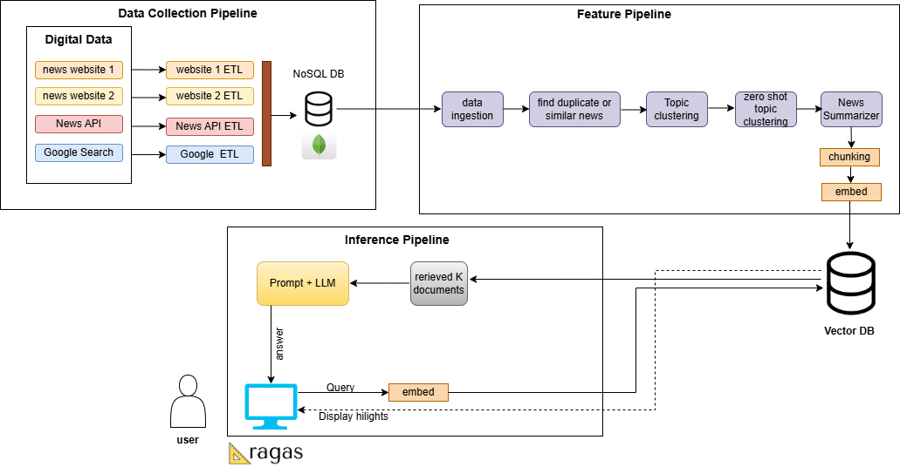

# FOBOH_NewsRAG
This project is an end-to-end AI-driven pipeline that extracts, processes, categorizes, and presents daily news highlights from multiple Australian news outlets. The system is designed to streamline and summarize news content across sports, lifestyle, music, and finance categories, offering users a smart and interactive way to stay updated

## 🛠 Tech Stack

- 🐍 **Python** – Core language for backend, scripting, and ML development  
- 🦜 **LangChain** – Framework for building LLM-powered applications  
- 🍃 **MongoDB** – NoSQL database for storing documents, metadata, and vector embeddings  
- 🌐 **Streamlit** – Rapid UI development for ML demos and LLM-based tools  
- 📈 **Scikit-learn** – Classic machine learning library for modeling and evaluation  
- 🤖 **OpenAI** – API for powerful LLMs like GPT-4 and embedding models  
- 🤗 **Hugging Face Transformers** – Pretrained models for NLP, multimodal tasks, and fine-tuning  

---
# 🚀 How to Run the Code

## 1. 🔧 Clone the Repository

```bash
git clone https://github.com/PubuduLasith093/FOBOH_NewsRAG.git
cd FOBOH_NewsRAG
```
## 2. 🔐 Add API Keys to .env File

```bash
OPENAI_API_KEY=your_openai_api_key_here
MONGO_URI=your_mongodb_connection_uri_here
```
---

## 3.💻 Create a Virtual Environment and Install Dependencies
```bash
conda create -p venv python==3.11 -y
conda activate venv/
pip install -r requirements.txt
```
---
## 4. ▶️ Run the Application
```bash
streamlit run app.py
```
---
## 5. 🧱 Architecture

